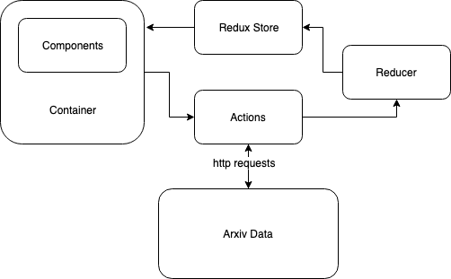

# Ginger Test Project

Production version of the application using AWS: 
[Check Production Version](http://ginger-env.3khafvwt37.us-east-2.elasticbeanstalk.com/)

This is a Ginger Test Project created by ***Geon Yoon***.
I choose to build a client-side app since this application does not require complex computation. Most work can be done at the front-end side without communicating with a backend server(This is actually wrong. I explain the reason at the bottom).

## Structure of the application
- components: All the view codes locate here.
- containers: Recieve and transfer the state and dispatch-actions to components
- actions: Http requests and data processing happen here.
- reducers: Redux state is modified here.


*Flow of this application*

## Assumptions I made
1. Articles are not sorted. 
2. Only 10 articles are fetched for the first time. When users click (+) button, the application brings ten more items and adds them up to the existed article list. 
3. Users do not see the entire authors who have published articles over the past 30 days. Only top 50 authors, sorted by the number of articles they published, are shown(all of the authors are still stored in Redux store).
4. Saved data in Redux store are removed when users exit or refresh the current tap.

## Testing and Bugs
- Unfortunately, autonomous test codes have not been made. If it were made, it would be automatically tested by Travis-CI when the application is pushed to Github.

- There is one thing that I did not implement. I should've created the loop and kept fetching the data until I reached the articles that released over 30 days ago. However, it took too much time to fetch the data when I created the loop since searching for articles by author name was not accurate. For example, if the name of the author is K. rolling, the search result gave me every article that had the author's name containing K. So I just set the max request to 80 articles and made it the one-time request. If I had more time, I would have created a backend that can do this fetching.

## How to run the application in the local environment

Clone the repository and get inside of the root directory.
```
git clone git@github.com:GeonYoon/Ginger.git
cd Ginger
```

### Run with Docker
*You need to stall Docker in your local computer first.*
Then you can run this application by typing the following lines:
```
docker-compose up --build
```
Check localhost:3050

### Run with NPM
*You need to pull the files in npm-version branch*
Then you can run this application by typing the following lines:
```
cd frontend
npm install
npm start
```
Check localhost:3000

## Built With
* [React](https://reactjs.org/) - used to build client-side
* [Redux](http://redux.js.org/docs/basics/UsageWithReact.html) - predictable state container for JavaScript apps
* [Axios](https://github.com/axios/axios) - promise based HTTP client for the browser and node.js
* [Docker](https://www.docker.com/) - computer program that performs operating-system-level virtualization
* [AWS Elastic Beanstalk](https://aws.amazon.com/elasticbeanstalk/) - an orchestration service offered from Amazon Web Services for deploying infrastructure which orchestrates various AWS services, including EC2, S3, Simple Notification Service, CloudWatch, autoscaling, and Elastic Load Balancers. 
* [AWS VPC](https://aws.amazon.com/vpc/) - enables you to define a virtual network in your own logically isolated area within the AWS cloud,
* [AWS IAM](https://aws.amazon.com/iam/) - AWS Identity and Access Management (IAM) enables you to manage access to AWS services and resources securely.
* [Travis CI](https://travis-ci.org/) - Travis CI is a hosted, distributed continuous integration service used to build and test software projects hosted at GitHub
* [Nginx](https://www.nginx.com/) - Nginx is a web server which can also be used as a reverse proxy, load balancer, mail proxy, and HTTP cache

## Authors
* **Geon Yoon ** - *Initial work* - [GeonYoon](https://github.com/GeonYoon)
